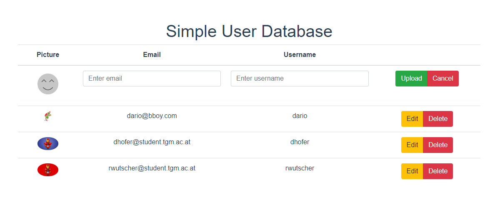

# "Restful User-Service"

## Aufgabenstellung
Die detaillierte [Aufgabenstellung](TASK.md) beschreibt die notwendigen Schritte zur Realisierung.

## Server

### Requirements
+ [Python 3.6^](https://www.python.org/)
+ [Tox](https://tox.readthedocs.io/en/latest/)
+ [pytest](https://docs.pytest.org/en/latest/)
+ [PyTestFlask](https://pytest-flask.readthedocs.io/en/latest/)
+ [Flask](https://flask-restful.readthedocs.io/en/latest/)

### Deployment
[sew.projects.rwutscher.com](sew.projects.rwutscher.com)
Um den Server zu starten muss der folgende Befehl verwendet werden:
```
python src\main\python\server\main.py
```
oder docker-compose:
```
docker-compose up --build
```
### Verwendung

Um die CRUD funktionen zu verwenden müssen `/students` Requests mit den 
entsprechenden HTTP Funktionen getätigt werden. 

#### CREATE
> POST <URL>/students

|Parameter|Beschreibung|Erforderlich|
|---|---|---|
|email|Die Email-Addresse des Benutzers|Ja|
|username|Der Username des Benutzers|Ja|
|pictureLink|Die URL zu einem Bild, welches als Profilbild verwendet werden soll|Nein|
|picture|Ein Bild im base64 Format, welches als Profilbild verwendet werden soll|Nein|
|password|Das Passwort, dass ein User zum einloggen verwenden kann|Nein|

Es kann entweder ein pictureLink oder ein picture Parameter pro Request verwendet werden.
#### READ
> GET <URL>/students

|Parameter|Beschreibung|Erforderlich|
|---|---|---|
|email|Die Email-Addresse des Benutzers|Nein|
|username|Der Username des Benutzers|Nein|

Wenn keiner der beiden Parameter mitgegeben wird, werden alle in der Datenbank gespeicherten
Benutzer zurückgegeben.
#### UPDATE
> PATCH <URL>/students

|Parameter|Beschreibung|Erforderlich|
|---|---|---|
|email|Die Email-Addresse des Benutzers der aktualisiert werden soll|Ja|
|username|Der neue Username des Benutzers|Nein|
|pictureLink|Die URL zu einem Bild, welches als neues Profilbild verwendet werden soll|Nein|
|picture|Ein Bild im base64 Format, welches als neues Profilbild verwendet werden soll|Nein|
|password|Das Passwort, dass ein User zum einloggen verwenden kann|Nein|

Es kann entweder ein pictureLink oder ein picture Parameter pro Request verwendet werden.
#### DELETE
> DELETE <URL>/students

|Parameter|Beschreibung|Erforderlich|
|---|---|---|
|email|Die Email-Addresse des Benutzers der gelöscht werden soll|Ja|
### Testing
Um die python tests auszuführen muss der `tox` Befehl in einer Kommandozeile
ausgeführt werden.

## Vue Client



### Installation
Um einen Testserver zu starten:
```
cd src/main/vue/client
npm install
npm run dev
```
Um Files zur Verwendung für Webserver zu generieren:
```
cd src/main/vue/client
npm install
npm run build
```


## JavaFX Client
> IN DEVELOPMENT

## Installation

```
cd src/main/java
gradle build
gradle run
```

### Verwendung
Mit `gradle build` und `gradle run` starten und auf den `LoadUsers` Button drücken.

### TODO
* [X] READ Funktionalität
* [ ] CRETE Funktionalität
* [ ] UPDATE Funktionalität
* [ ] DELETE Funktionalität

### Probleme
+ Bilder in Tabelle anzeigen
+ Schülerdaten beim starten laden

## Python Client
> Development not started

## Quellen

+ [VueCLI](https://cli.vuejs.org/)
+ [VueJS](https://vuejs.org/)
+ [Python](https://www.python.org/)
+ [pytest](https://docs.pytest.org/en/latest/)
+ [PyTestFlask](https://pytest-flask.readthedocs.io/en/latest/)
+ [Flask](https://flask-restful.readthedocs.io/en/latest/)
+ [Cypress](https://docs.cypress.io/guides/overview/why-cypress.html)
+ [Axios](https://github.com/axios/axios)
+ [tox](https://tox.readthedocs.io/en/latest/)
+ [TravisCI](https://docs.travis-ci.com/)
+ [JFoenix](http://www.jfoenix.com/)