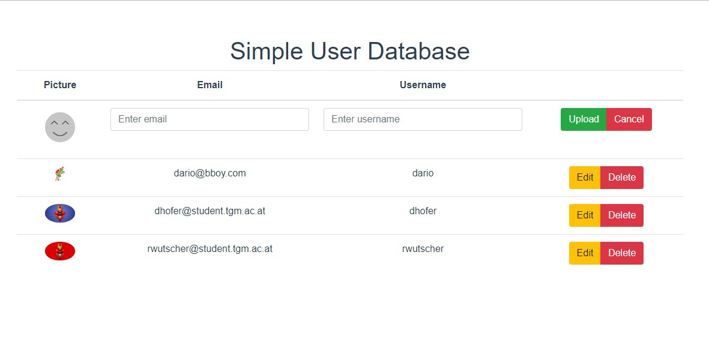

# "Restful User-Service"

## Aufgabenstellung
Die detaillierte [Aufgabenstellung](TASK.md) beschreibt die notwendigen Schritte zur Realisierung.


## Server

### Deployment
Um den Server zu starten muss der folgende Befehl verwendet werden:
```
python src\main\python\server\main.py
```

### Usage

Um die CRUD funktionen zu verwenden müssen `/students` Requests mit den 
entsprechenden HTTP Funktionen getätigt werden. 

#### CREATE
> POST <URL>/students

|Parameter|Beschreibung|Erforderlich|
|---|---|---|
|email|Die Email-Addresse des Benutzers|Ja|
|username|Der Username des Benutzers|Ja|
|pictureLink|Die URL zu einem Bild, welches als Profilbild verwendet werden soll|Nein|
|picture|Ein Bild im base64 Format, welches als Profilbild verwendet werden soll|Nein|

Es kann entweder ein pictureLink oder ein picture Parameter pro Request verwendet werden.
#### READ
> GET <URL>/students

|Parameter|Beschreibung|Erforderlich|
|---|---|---|
|email|Die Email-Addresse des Benutzers|Nein|
|username|Der Username des Benutzers|Nein|

Wenn keiner der beiden Parameter mitgegeben wird, werden alle in der Datenbank gespeicherten
Benutzer zurückgegeben.
#### UPDATE
> PATCH <URL>/students

|Parameter|Beschreibung|Erforderlich|
|---|---|---|
|email|Die Email-Addresse des Benutzers der aktualisiert werden soll|Ja|
|username|Der neue Username des Benutzers|Nein|
|pictureLink|Die URL zu einem Bild, welches als neues Profilbild verwendet werden soll|Nein|
|picture|Ein Bild im base64 Format, welches als neues Profilbild verwendet werden soll|Nein|

Es kann entweder ein pictureLink oder ein picture Parameter pro Request verwendet werden.
#### DELETE
> DELETE <URL>/students

|Parameter|Beschreibung|Erforderlich|
|---|---|---|
|email|Die Email-Addresse des Benutzers der gelöscht werden soll|Ja|
### Testing


## Vue Client

## JavaFX Client

## Quellen
